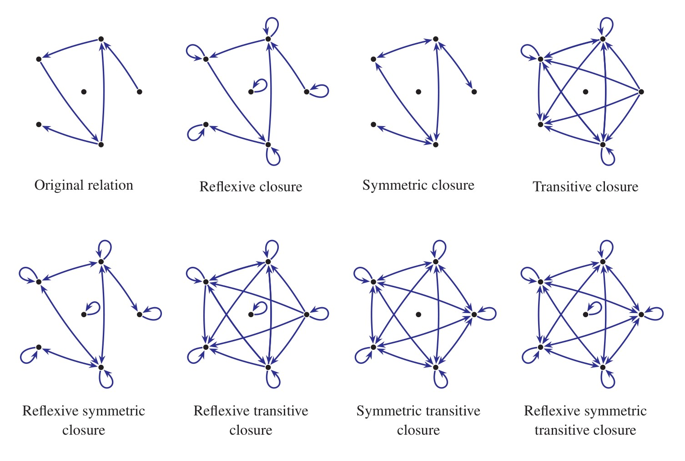

# Markov Chain

### Definitions of Markov Chain

* A **Markov chain** is a mathematical system that experiences transitions from one state to another according to certain [probabilistic](https://brilliant.org/wiki/probability-rule-of-product/) rules.
* It is one of the common _**stochastic process** _ (the process of some values changing randomly over time)_._
* The probability of any state transition is independent of time.

A _stochastic process_ $$X = { X(t): t \in T}$$  is a collection of random variables:

* The index of $$t$$ often represents time, and in that case the process $$X$$models the value of a random variables $$X$$that changes over time.
* We call $$X(t)$$ the _state_ of process at time $$t$$. We use $$X_t$$ interchangeably with $$X_t$$.

### **Markov property**

A discrete time stochastic process $$X_0, X_1, X_2, ...$$ is a Markov chain if

$$
\begin{aligned} P(X_t = a_1 | X_{t - 1} = a_{t - 1}, X_{t - 2} = a_{t - 2}, ..., X_0 = a_0) &= P(X_t = a_t | X_{t - 1} = a_{t - 1}) \\ &= P_{a_{t - 1}, a_t}.\\ \end{aligned}
$$

* This definition expresses that the state $$X_t$$ depends on the precious state $$X_{t - 1}$$ but is independent of the particular history of how the process arrived at state $$X_{t -1}$$.


It does not imply that $$X_t$$ is independent of the random variables $$X_t$$ is independent of the random variables $$X_0, X_1, ..., X_{t-1}$$; **it just implies that any dependency of** $$X_t$$ **on** **the past is captured in the value of** $$X_{t - 1}$$.


* It differs from a general stochastic process in that a Markov chain must be "**memory-less**." That is, (the probability of) future actions are <mark style="color:blue;">**not dependent**</mark> upon the steps that led up to the present state.

**The transition probability**:

$$
P_{i,j} = P(X_t = j | X_{t - 1} = i)
$$

is the probability that the process moves from $$i$$ to $$j$$ in one step.

* **Example**: A variant of the same question asks once again for ball color, but it allows replacement each time a ball is drawn. This creates a stochastic process with color for the random variable, which satisfies the Markov property.

**The transition matrix:**

$$
P = \begin{pmatrix}P_{0,0}&P_{0,1}&\cdots&P_{0,j} & \cdots\\P_{1,0}&P_{1,1}&\cdots&P_{1,j}& \cdots\\\vdots& \vdots &\ddots & \vdots & \ddots\\P_{i,0}& P_{i,1}&\cdots & P_{i,j} & \cdots \\ \vdots & \vdots & \ddots & \vdots & \ddots\end{pmatrix}
$$

That is, the entry in $$i$$th row and $$j$$th column is the transition probability $$P_{i,j}$$. It follows that, for all $$i, \sum_{j \geq 0} P_{i,j} = 1$$.

* A **transition matrix** $$P$$​ for Markov chain at time $$t$$ is a matrix containing information on the probability of transitioning between **states**.

All possible states at time $$t-1$$, we have:

$$
p_i(t) = \sum_{j \geq 0} p_j (t-1)P_{i,j}
$$

or

$$
\overline{p}(t) = \overline{p}(t-1)P.
$$

**Example**:

<figure><figcaption><p>From the book <em>Probability and Computing</em> by Michael Mitzenmacher and Eli Upfal, Page 170</p></figcaption></figure>

For any $$m \geq 0$$, we define m-step transition probability

$$
p^m_{i,j} = P(X_{x + m} = j | X_t = i)
$$

as the probability that the chain moves from state $$i$$ **** to state $$j$$ in exactly $$m$$ steps.

Conditioning on the first transition from $$i$$, we have:

$$
P^m_{i,j} = \sum_{k \geq 0} p_{i,k} P^{m - 1}_{k,j}.
$$



For the time-independent Markov chain described by the picture below, what is its 2-step transition matrix?





Starting from the mainland, what is the probability (in percentage) that the travelers will be on the mainland at the end of a 3-day trip?

.png>)



State the transition matrix:

$$
P = \begin{pmatrix}0.3&0.7\\0.9&0.1\end{pmatrix}
$$

It follows that the 2-step transition matrix is:

$$
P^2 = \begin{pmatrix}0.3&0.7\\0.9&0.1\end{pmatrix} \cdot \begin{pmatrix}0.3&0.7\\0.9&0.1\end{pmatrix} = \begin{pmatrix}0.72&0.28\\0.36&0.63\end{pmatrix}
$$







### Markov Chain Simple Applications in Python

```python
matrix = np.matrix([[0.9, 0.075, 0.025],
                    [0.15, 0.8, 0.05],
                    [0.25, 0.25, 0.5]], dtype=float)
vector1 = np.matrix([[0.3, 0.4, 0.3]], dtype=float)

for i in range(100):
    vector1 = vector1 * matrix
    print('Courrent round: {}'.format(i+1))
    print(vector1)
```

11111

### Applications

#### 2-SAT Algorithm

1111

#### 3-SAT Algorithm

111

### Classification of States


### References

1. [Markov Chain by Brilliant Math](https://brilliant.org/wiki/markov-chains/)
2. Probability and Computing by Michael Mitzenmacher and Eli Upfal
